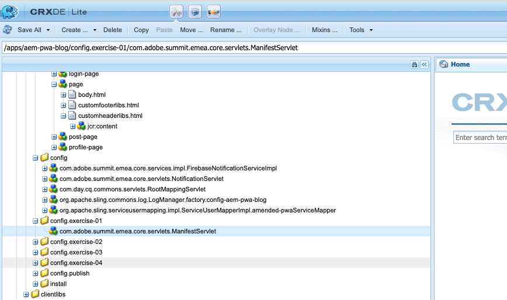
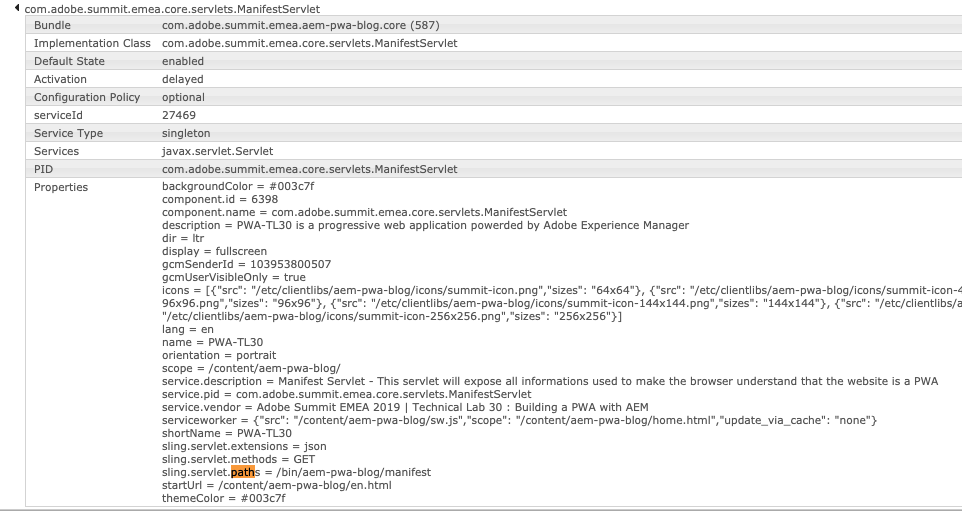
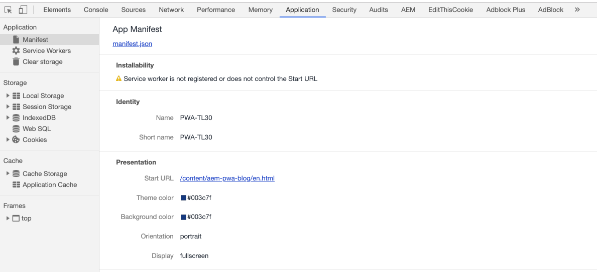

  

## 2. Add the web app manifest

### Purpose

- The manifest.json file is the ID of your application in the browser, it gives informations about your web application and how it should behave when 'installed' 
on the user's mobile device or desktop.

### Hands on tasks

- Go back to your CRXDE :
  - open up this file 
`/apps/aem-pwa-blog/components/structure/page/customheaderlibs.html` and add the following code :
```
<link rel="manifest" href="/bin/aem-pwa-blog/manifest.json">
```


 - Copy the Manifest servlet configuration from `/apps/aem-pwa-blog/config.exercise-01/com.adobe.summit.emea.core.servlets.ManifestServlet` 
 to `/apps/aem-pwa-blog/config`
  
 
 - Check if the service is fully loaded in the OSGI Console  [Manifest Servlet](http://localhost:8458/system/console/components/com.adobe.summit.emea.core.servlets.ManifestServlet)
 
   
  
 - Update the name property from the configuration you have moved before. e.g : `name:"PWA-TL30"` to `name:"PWA-TL30-{YOUR-NAME}"` 
 
 - Open the [Manifest](http://localhost:4503/bin/aem-pwa-blog/manifest.json) file in your browser you should see this

```json
{
  "gcm_sender_id": "294077202000",
  "orientation": "portrait",
  "theme_color": "#003c7f",
  "display": "fullscreen",
  "start_url": "/content/aem-pwa-blog/en.html",
  "description": "PWA-TL30 is a progressive web application powerded by Adobe Experience Manager",
  "dir": "ltr",
  "icons": [
    {
      "sizes": "64x64",
      "src": "/etc/clientlibs/aem-pwa-blog/icons/summit-icon.png"
    },
    {
      "sizes": "48x48",
      "src": "/etc/clientlibs/aem-pwa-blog/icons/summit-icon-48x48.png"
    },
    {
      "sizes": "96x96",
      "src": "/etc/clientlibs/aem-pwa-blog/icons/summit-icon-96x96.png"
    },
    {
      "sizes": "144x144",
      "src": "/etc/clientlibs/aem-pwa-blog/icons/summit-icon-144x144.png"
    },
    {
      "sizes": "192x192",
      "src": "/etc/clientlibs/aem-pwa-blog/icons/summit-icon-192x192.png"
    },
    {
      "sizes": "256x256",
      "src": "/etc/clientlibs/aem-pwa-blog/icons/summit-icon-256x256.png"
    }
  ],
  "serviceworker": {
    "update_via_cache": "none",
    "src": "/content/aem-pwa-blog/sw.js",
    "scope": "/content/aem-pwa-blog/home.html"
  },
  "background_color": "#003c7f",
  "scope": "/content/aem-pwa-blog/",
  "name": "PWA-TL30-{YOUR-NAME}",
  "gcm_user_visible_only": true,
  "short_name": "PWA-TL30",
  "lang": "en"
}

```

### Checks

- Go to the home page [Home page](http://localhost:8458/content/aem-pwa-blog/home.html), open the chrome dev tools by clicking onto F12
  


### Go further

- https://developers.google.com/web/fundamentals/web-app-manifest/
- https://www.w3.org/TR/appmanifest/ 
- https://github.com/w3c/manifest/

Go to the next chapter : [Access the emulator camera](chapter-3.md)