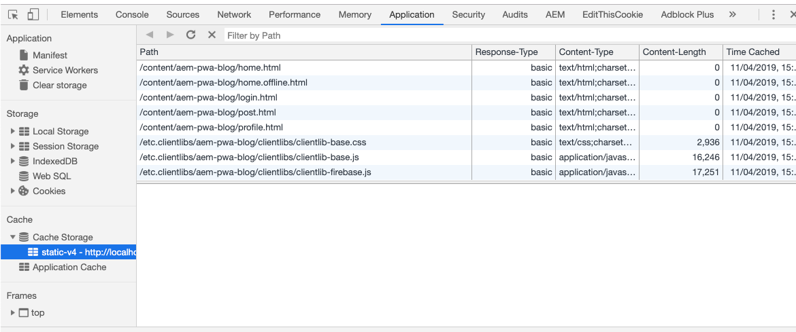

 

## 4. Cache the app shell

### Purpose

- A service worker can XXXX . TO update

### Hands on tasks

- Go back to your CRXDE :
  - open up this file 
`/etc/clientlibs/aem-pwa-blog/sw.js` and add the following code to the service worker:

 - Caching static content content to be able to have a consistent UI even in offline mode

```
self.addEventListener('install', function(event) {
    console.log('[TL30-PWA] >>>>> Installing Service Worker ...', event);
    event.waitUntil(
        caches.open(CACHE_STATIC_NAME)
            .then(function(cache) {
                console.log('[TL30-PWA][install] >>>>> Precaching App Shell');
                cache.addAll([
                    '/content/aem-pwa-blog/home.html',
                    '/content/aem-pwa-blog/post.html',
                    '/content/aem-pwa-blog/profile.html',
                    '/content/aem-pwa-blog/login.html',
                    '/etc.clientlibs/aem-pwa-blog/clientlibs/clientlib-vendor.js',
                    '/etc.clientlibs/aem-pwa-blog/clientlibs/clientlib-firebase.js',
                    '/etc.clientlibs/aem-pwa-blog/clientlibs/clientlib-base.js',
                    '/etc/clientlibs/aem-pwa-blog/fonts-awesome/fontawesome-webfont.woff2?v=4.7.0',
                    '/etc.clientlibs/aem-pwa-blog/clientlibs/clientlib-base.css',
                    '/etc.clientlibs/aem-pwa-blog/clientlibs/clientlib-vendor.css',
                    '/etc.clientlibs/core-components-examples/clientlibs/clientlib-themes/core-components-clean.css',
                    '/etc/clientlibs/aem-pwa-blog/logos/summit-logo-m.png',
                    '/etc/clientlibs/aem-pwa-blog/logos/summit-logo.png',
                    '/etc/clientlibs/aem-pwa-blog/icons/summit-icon-144x144.png',
                    '/content/aem-pwa-blog/home.offline.html',
                    '/etc/clientlibs/aem-pwa-blog/icons/favicon.ico'
                ]);
                console.log('[TL30-PWA][install] <<<<< The App Shell has been cached....');
            })
    )
});
```

 - Caching dynamic content, when a fetch (AJAX) request is executed
 
```
self.addEventListener('fetch', function(event) {
    event.respondWith(
        caches.match(event.request)
            .then(function(response) {
                console.log('[TL30-PWA][fetch] >>>>> Catching an HTTP request by the Service Worker ....');
                if (response) {
                    console.log('[TL30-PWA][fetch] Catching an HTTP request by the Service Worker ....');
                    return response;
                } else {
                    console.log('[TL30-PWA][fetch] Executing the real HTTP request by the Service Worker ....');
                    return fetch(event.request)
                        .then(function(res) {
                            return caches.open(CACHE_DYNAMIC_NAME)
                                .then(function(cache) {
                                    cache.put(event.request.url, res.clone());
                                    return res;
                                })
                        })
                        .catch(function(err) {
                            console.error('[TL30-PWA][fetch] HTTP request execution by the Service Worker failed ....');
                        });
                }
                console.log('[TL30-PWA][fetch] <<<<< The HTTP request has been handled by the Service Worker properly ....');
            })
    );
}); 
```

 - Inspect the home page by pressing onto F12 , Go to the Application tab you will see
 
  
 
### Go further

- [0] To update

 
Go to the next chapter : [Background Synchronization ](chapter-5.md)